# Introducción

LinguaPlay es una aplicación para practicar inglés jugando. La usan dos tipos de personas: los jugadores, que aprenden, y los administradores, que gestionan el contenido y moderan lo que publican los jugadores. Funciona en Android, iOS y navegadores web, y se apoya en una API central que coordina las partidas en tiempo real, guarda los datos y usa servicios de inteligencia artificial para revisar textos en inglés, narrarlos y dibujar ilustraciones.

El sistema ofrece dos modos de juego:

- **Trivia.** Partidas de preguntas por nivel del Marco Común Europeo de Referencia para las lenguas (MCER; Consejo de Europa, 2020), individuales o multijugador, con puntaje por velocidad.
- **Historieta.** Los jugadores escriben juntos, por turnos, una historieta en inglés. Cada viñeta recibe correcciones de la IA antes de confirmarse. Al terminar, la historieta se narra con voz sintética, se ilustra y queda publicada en un catálogo donde otros jugadores pueden leerla, reaccionar a cada viñeta y darle like.

Este manual describe los requerimientos, la instalación del entorno, la arquitectura, la organización del código, la base de datos, el despliegue, la seguridad y el mantenimiento del sistema. Está dirigido a desarrolladores y administradores técnicos. Todo lo que se describe corresponde al código de los repositorios `LP-API`, `LP-MOB` y `linguaplay-core` en la fecha de este documento.

# Requerimientos del sistema

## Requerimientos funcionales

Los requerimientos se agrupan por rol. El rol se guarda como grupo del usuario en AWS Cognito (`PLAYER` o `ADMIN`), y la API lo verifica en cada petición.

### Transversales

**Tabla 1**

*Requerimientos funcionales transversales*

| Código | Requerimiento |
|---|---|
| RF-01 | Registrar una cuenta con correo, nickname y contraseña (mínimo 8 caracteres, con mayúscula, minúscula, número y un carácter especial de `@ $ ! % * ? &`). Todo usuario nuevo queda con el rol `PLAYER`. |
| RF-02 | Iniciar sesión con correo y contraseña y mantener la sesión con renovación automática de tokens. |
| RF-03 | Cerrar sesión, lo que revoca el token de renovación. |
| RF-04 | Consultar el perfil propio: puntaje, partidas ganadas, racha, precisión, progreso por nivel y actividad en el modo Historieta. |
| RF-05 | Mostrar la interfaz en modo claro u oscuro según el sistema operativo. |

*Nota.* Elaboración propia a partir de `apps/LP-API/src/modules/auth` y `apps/LP-MOB/src/features/auth`.

### Rol Jugador

**Tabla 2**

*Requerimientos funcionales del rol Jugador*

| Código | Requerimiento |
|---|---|
| RF-06 | Crear una partida de trivia individual o multijugador eligiendo el nivel (A1 a C2). |
| RF-07 | Unirse a una sala multijugador con su código. |
| RF-08 | Responder preguntas de texto, imagen, audio o video dentro del tiempo límite, con puntaje según la rapidez (entre 500 y 1 000 puntos por respuesta correcta). |
| RF-09 | Ver los resultados de la partida y pedir revancha. |
| RF-10 | Crear una historieta, o unirse a una con su código, y configurarla (viñetas, tiempo por turno, nivel y si los borradores se comparten). |
| RF-11 | Escribir una viñeta con texto y escenario, elegir o crear personajes y pedir la revisión de inglés (hasta 2 revisiones por viñeta). |
| RF-12 | Ver el review final de la historieta: ranking, personajes y viñetas con imagen y narración, con reproducción de toda la historia o de cada viñeta. |
| RF-13 | Consultar las historietas propias ("My stories") y explorar el catálogo de historietas publicadas, con búsqueda y filtro por nivel. |
| RF-14 | Reaccionar con un emoji a cada viñeta y dar o quitar el like de una historieta. Ambos se guardan. |

*Nota.* Elaboración propia a partir de los módulos `game`, `story-game` y `story-history` de la API y de las pantallas de LP-MOB.

### Rol Administrador

**Tabla 3**

*Requerimientos funcionales del rol Administrador (solo en la versión web)*

| Código | Requerimiento |
|---|---|
| RF-15 | Consultar el dashboard de la aplicación: usuarios, actividad, preguntas, partidas, historietas y uso por nivel y categoría. |
| RF-16 | Crear, editar, activar, desactivar y eliminar categorías de preguntas (nivel y tipo de habilidad). |
| RF-17 | Crear, editar, activar, desactivar y eliminar preguntas y sus opciones de respuesta, con archivos de imagen, audio o video. |
| RF-18 | Listar las historietas con búsqueda y filtro por estado (publicadas o quitadas) y ver su detalle. |
| RF-19 | Quitar una historieta indicando el motivo y una nota, y restaurarla. Cada acción queda en el historial de moderación. |
| RF-20 | Regenerar las imágenes que faltan en una historieta. |

*Nota.* El administrador también tiene todas las funciones del jugador. Las secciones de administración solo existen en la versión web (`MainTabs.web.tsx`).

## Requerimientos no funcionales

**Tabla 4**

*Requerimientos no funcionales*

| Código | Categoría | Requerimiento |
|---|---|---|
| RNF-01 | Seguridad | Toda ruta, salvo registro, inicio de sesión y renovación, exige un access token de Cognito válido. Las rutas de administración exigen además el grupo `ADMIN`. |
| RNF-02 | Seguridad | Los archivos de S3 son privados y se entregan con URLs firmadas que caducan. |
| RNF-03 | Disponibilidad | Si falla un servicio de IA (revisión, título, narración o imagen), la partida no se bloquea: sigue sin ese resultado. |
| RNF-04 | Escalabilidad | Se pueden ejecutar varias instancias de la API: el estado de las partidas vive en Redis, cada cambio usa un lock distribuido y Socket.IO usa un adapter sobre Redis. |
| RNF-05 | Consistencia | El tiempo de las partidas se mide con el reloj del servidor. Los clientes calculan su diferencia de reloj con `timeSync`. |
| RNF-06 | Portabilidad | Un solo código cliente para Android, iOS y web (Expo). |
| RNF-07 | Mantenibilidad | El esquema de la base de datos solo cambia mediante migraciones versionadas. |
| RNF-08 | Usabilidad | La interfaz se adapta a móvil, tableta y escritorio (breakpoints 0, 768, 1 024 y 1 280 px). |

*Nota.* Elaboración propia.

## Instalación local (entorno de desarrollo)

1. Clonar el repositorio con sus submódulos:

   ```bash
   git clone --recurse-submodules https://github.com/smyleface18/LinguaPlay.git
   cd LinguaPlay
   ```

2. Preparar la API:

   ```bash
   cd apps/LP-API
   yarn install
   cp .env.template .env
   docker compose up -d
   yarn migration:run
   yarn start:dev
   ```

   En `.env` hay que completar la conexión a PostgreSQL y Redis, las credenciales de AWS (región, claves, User Pool y App Client de Cognito, bucket de S3) y, opcionalmente, los servicios de IA (ver la Tabla 7). `docker compose up -d` levanta PostgreSQL 15, Redis Stack y Redis Commander (puerto 8081).

3. Preparar el cliente:

   ```bash
   cd apps/LP-MOB
   yarn install
   cp .env.example .env
   yarn web
   ```

   `EXPO_PUBLIC_API_BASE_URL` debe apuntar a la API. En un teléfono físico hay que usar la IP de la computadora en la red local o un túnel, no `localhost`.

4. Verificar: `GET http://localhost:3000/` responde 200 y la aplicación muestra la pantalla de inicio de sesión.

## Instalación de herramientas requeridas

### Git

Descargar Git desde https://git-scm.com e instalarlo con las opciones por defecto. Verificar con `git --version`. El repositorio usa submódulos, así que siempre hay que clonar con `--recurse-submodules` o ejecutar `git submodule update --init --recursive`.

### Node.js y Yarn

Instalar Node.js 22 LTS (el mínimo es 20) desde https://nodejs.org. Después habilitar Yarn 1 con `corepack enable` o con `npm install -g yarn`. Verificar con `node -v` y `yarn -v`.

### Docker Desktop

Instalar Docker Desktop desde https://www.docker.com/products/docker-desktop. En Windows requiere WSL 2. Verificar con `docker --version` y `docker compose version`. Se usa para PostgreSQL y Redis en desarrollo y para el despliegue (Docker, s.f.).

### Expo y Android Studio

El cliente usa Expo SDK 54 (Expo, s.f.) y no requiere instalar Expo globalmente: se ejecuta con `npx expo`. Para Android se necesita Android Studio con un emulador, o la app Expo Go en un teléfono. Para compilar para iOS se necesita macOS con Xcode.

# Marco conceptual

## Aprendizaje de idiomas basado en juegos

LinguaPlay aplica la gamificación a la práctica del inglés como lengua extranjera. Premia la rapidez y la precisión en la trivia y la escritura colaborativa en la historieta, con retroalimentación inmediata. La retroalimentación de la historieta llega antes de confirmar cada viñeta: el jugador ve sus errores y la explicación en español, y puede corregirlos.

## Niveles del MCER

El contenido se organiza por los seis niveles del MCER: A1, A2, B1, B2, C1 y C2 (Consejo de Europa, 2020). En la trivia, cada categoría tiene un nivel y un tipo de habilidad: listening, grammar, reading, vocabulary, writing o speaking. En la historieta se eligen los niveles A1 a B2. La revisión de la IA adapta sus explicaciones al nivel elegido.

## Soporte normativo de referencia

En Colombia, el software se protege como obra literaria mediante el derecho de autor. La Ley 23 de 1982 regula el derecho de autor, y el Decreto 1360 de 1989 reglamenta la inscripción del soporte lógico (software) en el Registro Nacional del Derecho de Autor. El programa de computador, su descripción y el material auxiliar forman parte de lo que se registra. La ficha técnica que acompaña este manual está pensada para ese registro.

# Objetivo del sistema

Ofrecer una plataforma multiplataforma en la que estudiantes de inglés practiquen de forma lúdica, individual o colaborativa, con retroalimentación automática, y en la que los administradores gestionen el contenido y moderen lo que publican los jugadores.

# Alcance del manual técnico

Este manual cubre las tres piezas de software del repositorio:

- `apps/LP-API`: la API.
- `apps/LP-MOB`: el cliente Android, iOS y web.
- `linguaplay-core`: un paquete de tipos compartidos que hoy no usan las aplicaciones.

También cubre el despliegue con Docker Compose. No cubre:

- La configuración de las cuentas de AWS y Cloudflare, más allá de las variables y los permisos que el sistema necesita.
- La publicación en tiendas de aplicaciones: [PENDIENTE: cuenta de Expo/EAS y proceso de publicación].

# Arquitectura general del sistema

## Arquitectura lógica

LinguaPlay usa una arquitectura cliente-servidor. El cliente (LP-MOB) consume la API de dos formas: por HTTP REST, para las operaciones de cuenta, contenido, historietas guardadas, estadísticas y moderación, y por Socket.IO, para las partidas en tiempo real (namespaces `/game` y `/story`).

La API (LP-API) sigue la organización modular de NestJS (NestJS, s.f.). Cada módulo agrupa su controller o gateway, sus servicios y sus DTOs. La persistencia usa PostgreSQL con TypeORM (TypeORM, s.f.). El estado de las partidas en curso, los locks distribuidos y las colas de trabajos (BullMQ; BullMQ, s.f.) usan Redis. Los servicios externos son:

- AWS Cognito: identidad.
- Amazon S3: archivos.
- Amazon Bedrock: revisión de inglés y títulos.
- Amazon Polly: narración.
- Cloudflare Workers AI: imágenes.

**Figura 1**

*Diagrama de componentes*

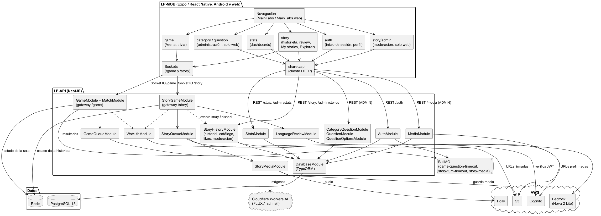

*Nota.* Elaboración propia. Fuente: `docs/diagrams/component-diagram.puml`.

## Componentes clave

**Tabla 5**

*Módulos de la API*

| Módulo | Responsabilidad |
|---|---|
| `AuthModule` | Registro, inicio de sesión, renovación y revocación de tokens con Cognito. Incluye `JwtAuthGuard`, `RolesGuard` y el decorador `@Roles`. |
| `CategoryQuestionModule`, `QuestionModule`, `QuestionOptionsModule` | CRUD del contenido de la trivia (solo `ADMIN`). |
| `MediaModule` | Subida de archivos a S3 con URL firmada, confirmación y limpieza de archivos huérfanos. |
| `GameModule`, `MatchModule`, `GameQueueModule` | Trivia en tiempo real: gateway `/game`, salas en Redis, game loop con la cola `game-question-timeout` y guardado de resultados. |
| `StoryGameModule`, `StoryQueueModule` | Historieta en tiempo real: gateway `/story`, turnos, borradores, reacciones y las colas `story-turn-timeout` y `story-media`. |
| `LanguageReviewModule` | Revisión de inglés de cada borrador y título de la historieta con Amazon Nova 2 Lite (Bedrock). |
| `StoryMediaModule` | Narración con Polly (audio y marcas de tiempo de cada palabra), imágenes con Cloudflare Workers AI y subida a S3. |
| `StoryHistoryModule` | Historietas terminadas en PostgreSQL: historial, catálogo, reacciones, likes y moderación. |
| `StatsModule` | Estadísticas del jugador y de la aplicación. |
| `CommonModule` | Configuración, Redis y locks, caché, almacenamiento en S3 y autenticación de sockets. |

*Nota.* Elaboración propia a partir de `apps/LP-API/src/app.module.ts`.

# Módulos funcionales del sistema

## Funcionalidades principales

### Trivia

1. El jugador crea una sala con un nivel y un modo (individual o multijugador).
2. La API elige preguntas aleatorias del nivel y genera un código legible para la sala (por ejemplo, `brave_fox_blue`). El estado de la sala se guarda en Redis.
3. Al iniciar la partida, un scheduler sobre BullMQ publica cada pregunta y la cierra al vencer su tiempo. Cada paso lleva un número de fase (`seq`), y los trabajos viejos se descartan.
4. Las respuestas se validan contra la ventana de tiempo de la pregunta, con la hora del servidor.
5. El puntaje sigue la fórmula de velocidad: `1000 × (1 − t/2)`, donde `t` es la fracción del tiempo usada. Una respuesta incorrecta suma 0.
6. Al terminar, los resultados se guardan en `game`, `game_session` y `player_answer`, y se actualizan las métricas del usuario.

**Figura 2**

*Secuencia de una partida de trivia*

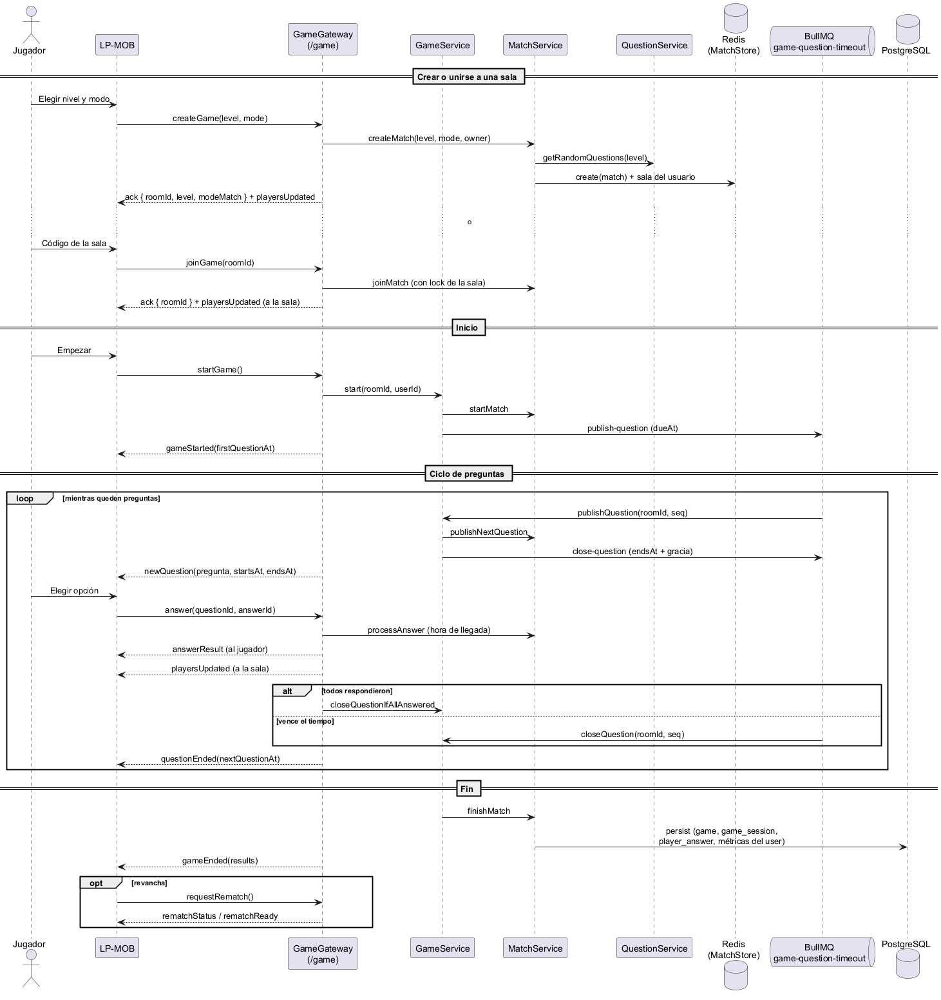

*Nota.* Elaboración propia. Fuente: `docs/diagrams/sequence-game-flow.puml`.

### Historieta

1. **Lobby.** El anfitrión crea una partida y comparte el código; los demás se unen.
2. **Configuración.** El anfitrión define:
   - la cantidad de viñetas (de 4 a 10);
   - el tiempo por turno (60, 90, 120 o 180 s);
   - el nivel (A1 a B2);
   - si los borradores se muestran a todos.
3. **Turnos.** Se juega con 1 a 6 jugadores y cada viñeta tiene un autor por turno:
   - el autor escribe el texto (entre 8 palabras y 320 caracteres) y el escenario (hasta 200 caracteres);
   - puede crear hasta 2 personajes nuevos por viñeta (máximo 3 personajes en la viñeta y 6 en la historieta);
   - puede pedir hasta 2 revisiones de IA.
4. **Puntaje.** Lo calcula el servidor a partir de la cantidad de errores, con bonificaciones por acertar a la primera y por autocorregirse. Si el turno vence, se confirma el último borrador.
5. **Procesamiento.** La partida pasa a PROCESSING y la cola `story-media` genera el audio y la imagen de cada viñeta, mientras Bedrock propone el título. El review empieza cuando está todo listo o cuando pasan 30 segundos. Un plazo de 3 minutos garantiza que la partida termine aunque falle la generación.
6. **Cierre.** Al llegar a FINISHED, la historieta se guarda en PostgreSQL y el review en vivo queda 1 hora en Redis.

**Figura 3**

*Secuencia de una partida de historieta*

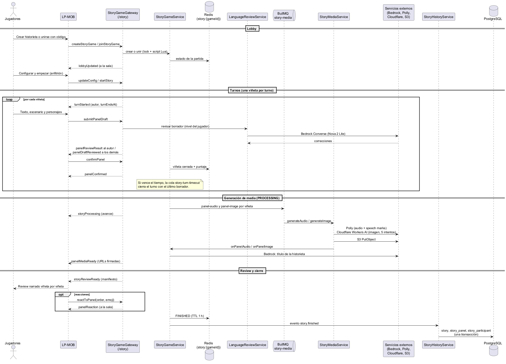

*Nota.* Elaboración propia. Fuente: `docs/diagrams/sequence-story-flow.puml`.

### Catálogo, reacciones y likes

Las historietas publicadas aparecen en el catálogo ("Explorar"), con búsqueda por título, jugadores o texto y filtro por nivel. Cualquier usuario puede reaccionar a una viñeta con uno de los emojis permitidos (👏 😂 😮 ❤️ 🔥) y dar like a la historieta. Las reacciones se guardan en la columna `reactions` (jsonb) de la viñeta, con una actualización atómica. Los likes van en la tabla `story_like`, con una fila única por usuario e historieta.

**Figura 4**

*Secuencia de lectura, reacciones y likes en el catálogo*

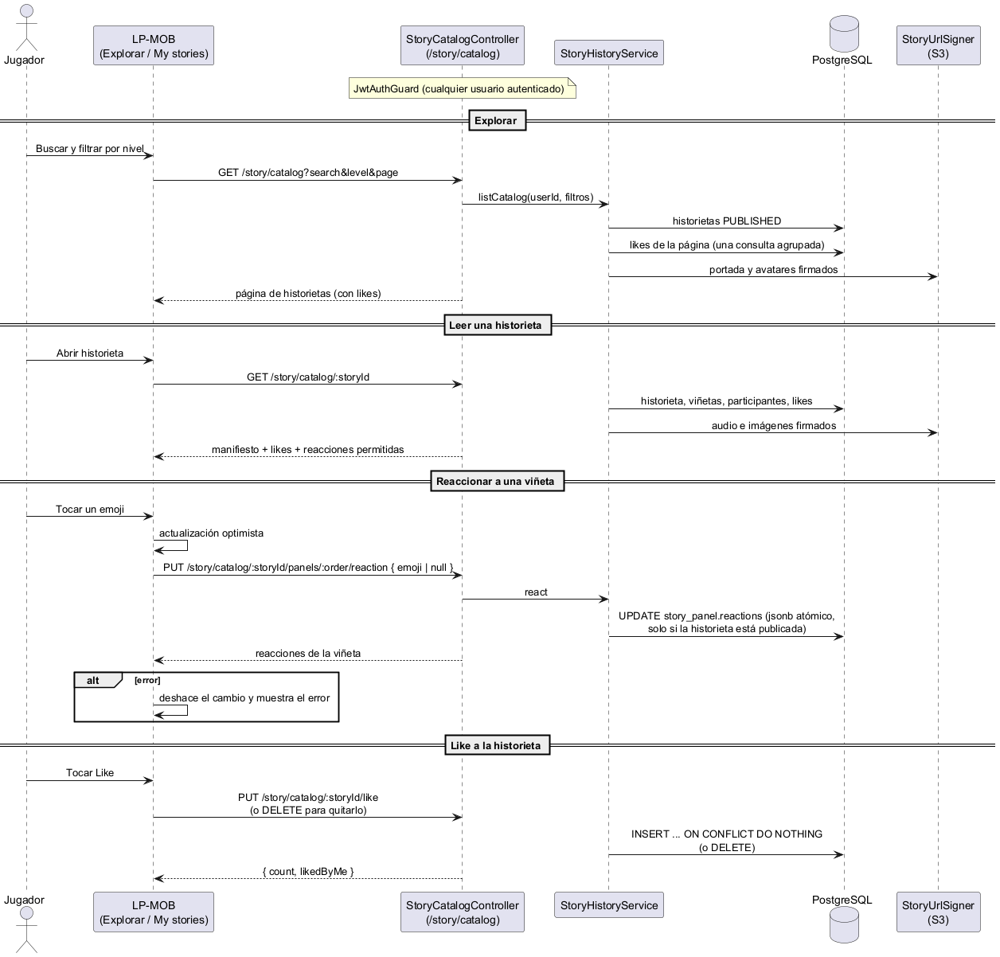

*Nota.* Elaboración propia. Fuente: `docs/diagrams/sequence-catalog-engagement.puml`.

### Moderación

Un administrador puede quitar una historieta publicada, con uno de estos motivos: contenido no apto, lenguaje ofensivo, datos personales, spam u otro (con una nota obligatoria). También puede restaurarla. Quitarla es un borrado lógico: la historieta deja de verse en el catálogo y en el historial de sus jugadores, pero se conserva. Cada acción se registra en `story_moderation_log`, en la misma transacción que el cambio de estado. Si dos administradores actúan a la vez, uno recibe el código 409. El administrador también puede volver a pedir las imágenes que faltan.

**Figura 5**

*Secuencia de la moderación*

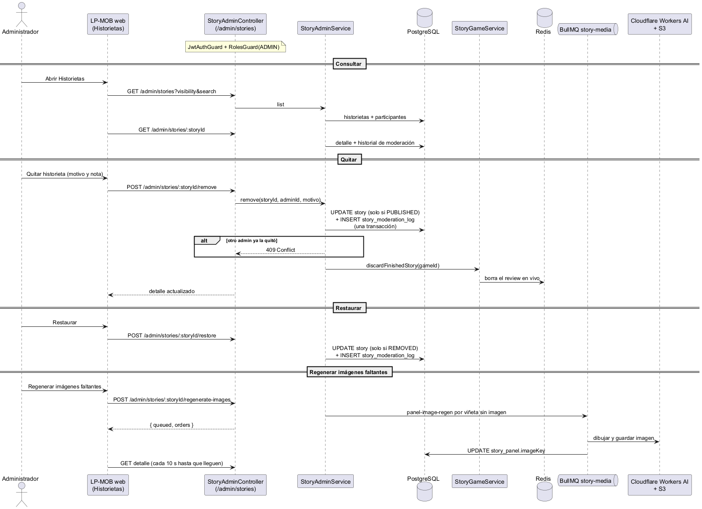

*Nota.* Elaboración propia. Fuente: `docs/diagrams/sequence-story-moderation.puml`.

## Reglas generales del modelo

- **Una partida a la vez.** Un usuario solo puede estar en una partida de historieta activa. Al reconectarse, desde cualquier instancia, vuelve a su partida.
- **Nada se pisa.** Toda modificación del estado de una partida se hace con el lock de la partida, y la escritura verifica que el lock siga vigente (fencing).
- **El servidor manda.** Los puntajes los calcula siempre el servidor; en la historieta nunca se usa un puntaje propuesto por la IA.
- **Solo se lee lo publicado.** Una historieta quitada no se sirve a los jugadores: la API responde 404.
- **Identidad compartida.** El id del usuario en la base de datos es el `username` que la API le asigna en Cognito (un uuid).

# Estructura general del árbol de directorios del proyecto

```
LinguaPlay/
├── apps/
│   ├── LP-API/                 # API NestJS
│   │   ├── src/
│   │   │   ├── main.ts         # arranque (CORS, filtros, validación, adapter de Socket.IO)
│   │   │   ├── app.module.ts
│   │   │   ├── common/src/     # envs, guards, redis, cache, storage, ws-auth, api
│   │   │   ├── db/             # entities, enum, migrations, data-source
│   │   │   └── modules/        # auth, category-question, question, question-options, media,
│   │   │                       # game, story-game, language-review, story-media,
│   │   │                       # story-history, stats
│   │   ├── test/               # e2e y scripts manuales contra la base local
│   │   ├── Dockerfile
│   │   └── docker-compose.yml  # PostgreSQL y Redis para desarrollo
│   └── LP-MOB/                 # App Expo / React Native
│       ├── src/
│       │   ├── app/            # navigation, providers
│       │   ├── features/       # auth, game, story, category, question, stats
│       │   ├── shared/         # api, components, ui (tema), adapters
│       │   └── store/          # Zustand
│       ├── Dockerfile.web
│       └── nginx.conf
├── linguaplay-core/            # tipos compartidos (sin uso actual)
├── deploy/                     # docker-compose.prod.yml y .env.prod.example
└── docs/                       # manuales, diagramas (diagrams/*.puml y png/)
```

**Figura 6**

*Estructura del proyecto*

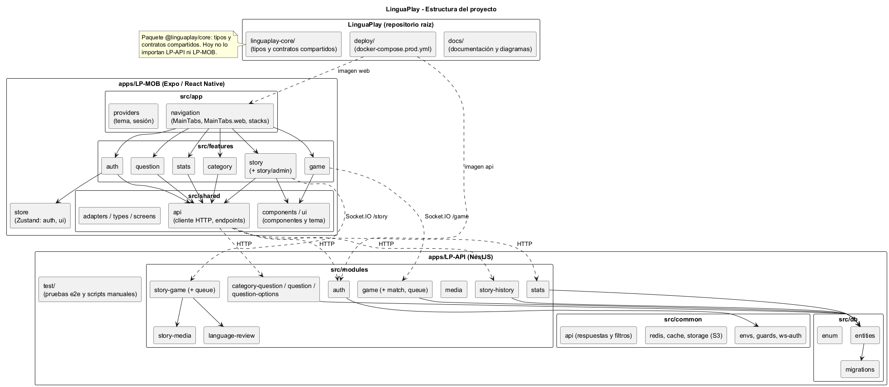

*Nota.* Elaboración propia. Fuente: `docs/diagrams/structure-project.puml`.

# Capa de modelos (entidades TypeORM)

Las entidades están en `apps/LP-API/src/db/entities` y todas heredan de `CoreEntity`, que aporta `id` (uuid), `active`, `createdAt` y `updatedAt`. La Tabla 6 resume cada una.

**Tabla 6**

*Entidades del modelo de datos*

| Entidad (tabla) | Descripción |
|---|---|
| `User` (`user`) | Usuario: nickname, correo, puntaje, partidas jugadas y ganadas, racha, rol, nivel y avatar. |
| `MediaAsset` (`media_asset`) | Archivo en S3: key, bucket, tipo, MIME, tamaño, estado (`PENDING` o `CONFIRMED`) y quién lo subió. |
| `CategoryQuestion` (`category_question`) | Categoría: nivel, tipo de habilidad y descripción. |
| `Question` (`question`) | Pregunta: tipo de contenido, texto, información adicional, tiempo límite, categoría y archivo opcional. |
| `QuestionOption` (`question_option`) | Opción: contenido, si es correcta y archivo opcional. Se borra en cascada con su pregunta. |
| `Game` (`game`) | Partida de trivia terminada, con su nivel y sus preguntas (relación N:M `game_questions_question`). |
| `GameSession` (`game_session`) | Participación de un jugador en una partida: puntaje y puesto. |
| `PlayerAnswer` (`player_answer`) | Respuesta: opción elegida, si acertó y el tiempo que tardó. |
| `Story` (`story`) | Historieta terminada: código de partida (único), título, nivel, idioma, viñetas, elenco (jsonb), fecha, visibilidad y datos de la remoción. |
| `StoryPanel` (`story_panel`) | Viñeta: autor, texto original y final, escenario, personajes, correcciones, puntaje, reacciones (jsonb) y keys del audio y la imagen. Única por historieta y orden. |
| `StoryParticipant` (`story_participant`) | Jugador de una historieta: puesto, viñetas escritas, puntajes y si abandonó. Único por historieta y usuario. |
| `StoryLike` (`story_like`) | Like de un usuario a una historieta. Único por historieta y usuario. |
| `StoryModerationLog` (`story_moderation_log`) | Acción de moderación: tipo (`REMOVED` o `RESTORED`), administrador, motivo y nota. |

*Nota.* Elaboración propia a partir de `apps/LP-API/src/db/entities`.

**Figura 7**

*Diagrama de clases*

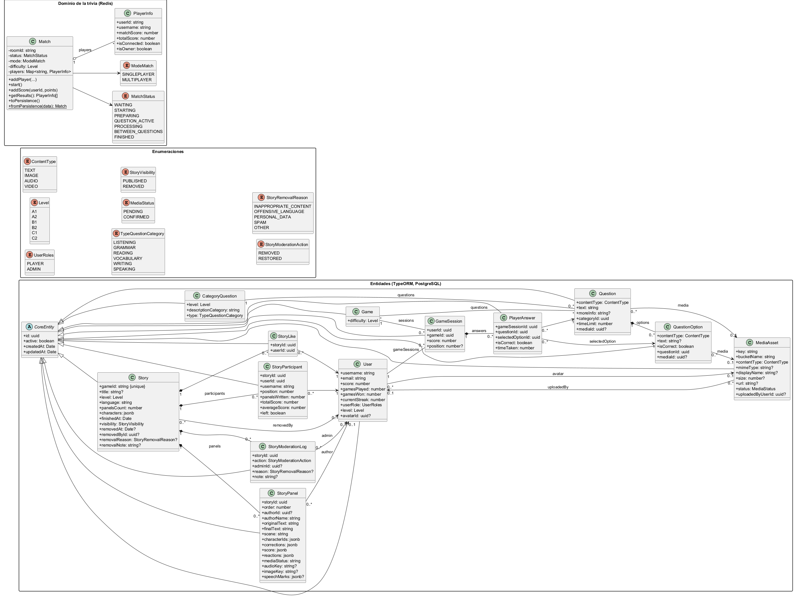

*Nota.* Elaboración propia. Incluye el dominio de la trivia que se guarda en Redis (`Match`). Fuente: `docs/diagrams/class-diagram.puml`.

# Capa de controladores (controllers y gateways)

## Controladores REST públicos y compartidos

`AuthController` (`/auth`) es público para registro, inicio de sesión y renovación. `GET /auth/me` y `POST /auth/revoke-token` requieren un token. `StoryHistoryController` (`/story/history`), `StoryCatalogController` (`/story/catalog`) y `PlayerStatsController` (`/stats/me`) requieren un token válido, sin importar el rol.

## Controladores del rol Administrador

Los siguientes controllers usan `JwtAuthGuard`, `RolesGuard` y `@Roles(UserRoles.ADMIN)`:

- `CategoryQuestionController` (`/category-question`).
- `QuestionController` (`/question`).
- `QuestionOptionsController` (`/question-options`).
- `MediaController` (`/media`).
- `AdminStatsController` (`/admin/stats`).
- `StoryAdminController` (`/admin/stories`).

## Gateways de tiempo real

- **`GameGateway` (`/game`).** Recibe `createGame`, `joinGame`, `startGame`, `answer`, `requestRematch`, `leaveRoom` y `timeSync`. Emite `playersUpdated`, `gameStarted`, `newQuestion`, `answerResult`, `questionEnded`, `gameEnded`, `rematchStatus`, `rematchReady` y `gameState`.
- **`StoryGameGateway` (`/story`).** Recibe:
  - `createStoryGame`, `joinStoryGame`, `updateConfig`, `kickPlayer` y `startStory`;
  - `submitPanelDraft`, `confirmPanel` y `reactToPanel`;
  - `getGameState`, `getReviewManifest`, `leaveGame`, `timeSync` y `getStoryRules`.

  Emite `lobbyUpdated`, `turnStarted`, `panelReviewResult`, `panelDraftReviewed`, `authorStatus`, `panelConfirmed`, `panelReaction`, `storyProcessing`, `panelMediaReady`, `storyReviewReady`, `gameState` y `storyError`.

Ambos gateways autentican el socket al conectarse con el access token de `handshake.auth.token` (`WsAuthService`).

# Capa de vistas (pantallas de LP-MOB)

`AppNavigator` muestra `AuthStack` (inicio de sesión y registro) sin sesión, y `MainTabs` con sesión. Las pestañas son:

- **Arena:** elegir entre Story Mode y Trivia, y jugar.
- **Explorar:** catálogo de historietas y su detalle.
- **Perfil:** dashboard del usuario, "My stories" y cierre de sesión.

En la versión web, un administrador ve además las pestañas Dashboard, Categorías, Preguntas e Historietas (moderación). Metro resuelve `MainTabs.web.tsx` solo al empaquetar para web, así que las pantallas de administración no se incluyen en la aplicación de Android ni de iOS. Cada feature separa la pantalla (`*.screen.tsx`, con la lógica y los hooks) de su vista (`*.view.tsx`, presentación pura). Las vistas específicas de web usan el sufijo `.web.tsx`.

# Definición de rutas principales

**Tabla 7**

*Variables de entorno de la API*

| Variable | Uso | Obligatoria |
|---|---|---|
| `DB_HOST`, `POSTGRES_PORT`, `POSTGRES_USER`, `POSTGRES_PASSWORD`, `POSTGRES_DB` | Conexión a PostgreSQL | Sí |
| `REDIS_HOST`, `REDIS_PORT`, `REDIS_URL`, `MATCH_TTL` | Redis y vida de las salas de trivia | Sí |
| `AWS_REGION`, `AWS_ACCESS_KEY_ID`, `AWS_SECRET_ACCESS_KEY` | Credenciales de AWS | Sí |
| `COGNITO_USER_POOL_ID`, `COGNITO_CLIENT_ID` | Identidad de los usuarios | Sí |
| `AWS_S3_BUCKET_NAME` | Bucket de archivos | Sí |
| `CORS_ORIGINS` | Orígenes web permitidos | No |
| `BEDROCK_REGION`, `BEDROCK_REVIEW_MODEL_ID` | Revisión y títulos con IA | No |
| `POLLY_VOICE_ID`, `POLLY_REGION` | Narración | No |
| `IMAGE_PROVIDER`, `CF_ACCOUNT_ID`, `CF_API_TOKEN`, `CF_IMAGE_MODEL`, `IMAGE_TIMEOUT_MS` | Imágenes de las viñetas | No |

*Nota.* Fuente: `apps/LP-API/.env.template` y `EnvsService`.

**Tabla 8**

*Rutas REST de la API*

| Método | Ruta | Descripción | Acceso |
|---|---|---|---|
| POST | `/auth/signUp` | Registro | Público |
| POST | `/auth/signIn` | Inicio de sesión | Público |
| POST | `/auth/refresh-token` | Renovar tokens | Público |
| GET | `/auth/me` | Usuario autenticado | Autenticado |
| POST | `/auth/revoke-token` | Cerrar sesión | Autenticado |
| GET | `/stats/me` | Estadísticas propias | Autenticado |
| GET | `/story/history`, `/story/history/:storyId` | Historietas propias | Autenticado |
| GET | `/story/catalog`, `/story/catalog/:storyId` | Catálogo | Autenticado |
| PUT | `/story/catalog/:storyId/panels/:order/reaction` | Reaccionar a una viñeta | Autenticado |
| PUT, DELETE | `/story/catalog/:storyId/like` | Dar o quitar like | Autenticado |
| POST, GET, PATCH, DELETE | `/category-question[/:id]` | Categorías | ADMIN |
| POST, GET, PATCH, DELETE | `/question[/:id]`, `/question/batch` | Preguntas | ADMIN |
| POST, GET, PATCH, DELETE | `/question-options[/:id]`, `/question-options/batch` | Opciones | ADMIN |
| POST | `/media/presign`, `/media/:id/confirm`, `/media/cleanup` | Archivos | ADMIN |
| GET | `/admin/stats` | Estadísticas de la aplicación | ADMIN |
| GET | `/admin/stories`, `/admin/stories/:storyId` | Historietas para moderar | ADMIN |
| POST | `/admin/stories/:storyId/remove`, `/restore`, `/regenerate-images` | Moderación | ADMIN |

*Nota.* Todas las respuestas usan el formato `{ ok, data, message }`. Fuente: controllers de `apps/LP-API/src/modules`.

**Figura 8**

*Diagrama de casos de uso*

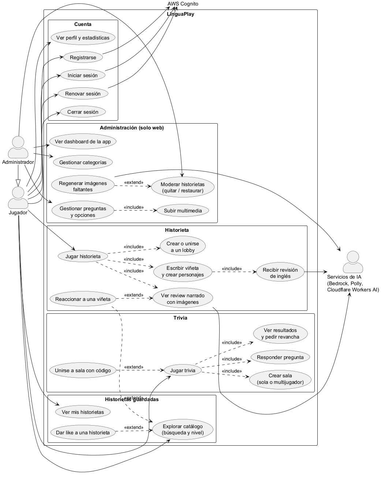

*Nota.* Elaboración propia. Fuente: `docs/diagrams/use-case.puml`.

# Base de datos

La base de datos es PostgreSQL 15 (PostgreSQL Global Development Group, s.f.) y se accede con TypeORM. La opción `synchronize` está desactivada: el esquema solo cambia con las 12 migraciones de `apps/LP-API/src/db/migrations`, que se ejecutan con `yarn migration:run`. En el despliegue se ejecutan solas al arrancar el contenedor.

Las reglas de integridad son:

- Las viñetas, los participantes, los likes y el historial de moderación se borran en cascada con su historieta.
- Si se borra un usuario:
  - se borran en cascada sus participaciones y sus likes;
  - las viñetas que escribió y las acciones de moderación que hizo quedan con el autor o el administrador en nulo (`SET NULL`), y se conservan.
- Los archivos referenciados por preguntas, opciones o avatares quedan en nulo si se borra el archivo.

Redis guarda el estado temporal:

- las salas de trivia, con la vida que marca `MATCH_TTL`;
- las partidas de historieta, que al terminar se conservan 1 hora;
- los locks, las colas de BullMQ y el adapter de Socket.IO.

**Figura 9**

*Modelo relacional*

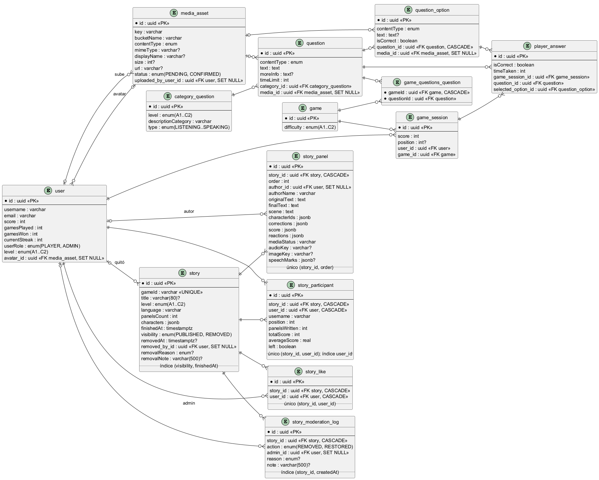

*Nota.* Elaboración propia a partir de las migraciones. Fuente: `docs/diagrams/relational-model.puml`.

**Figura 10**

*Diagrama entidad-relación (notación de Chen)*

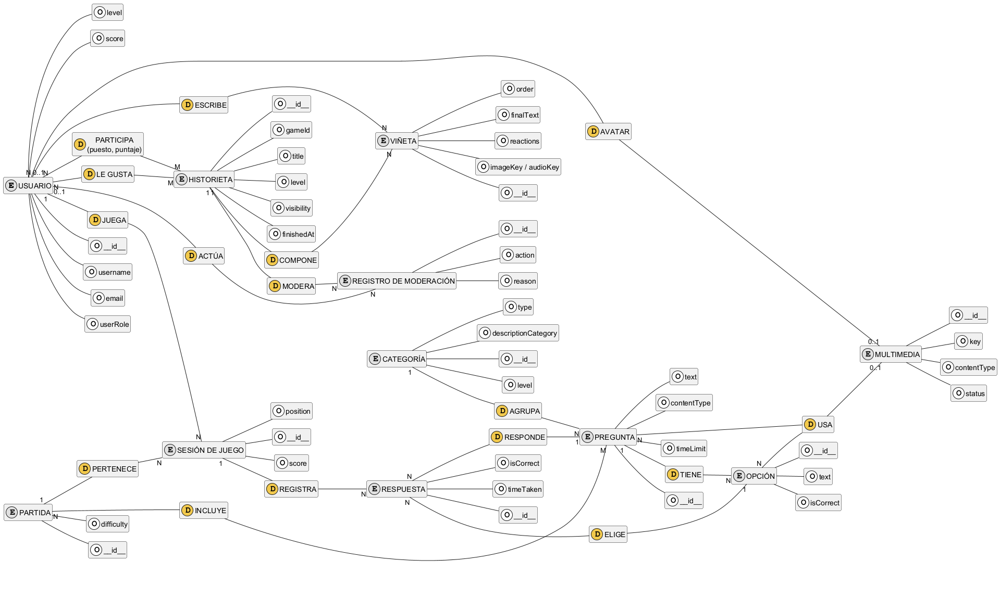

*Nota.* Elaboración propia. Fuente: `docs/diagrams/entity-relationship-chen.puml`.

# Procedimiento de despliegue

El repositorio incluye un despliegue con Docker Compose (`deploy/docker-compose.prod.yml`) que levanta cuatro servicios en un solo servidor:

- `postgres`: PostgreSQL 15, con un volumen persistente.
- `redis`: Redis Stack, con un volumen persistente.
- `api`: imagen de `apps/LP-API/Dockerfile` (Node 22). Ejecuta las migraciones pendientes y después inicia la API.
- `web`: imagen de `apps/LP-MOB/Dockerfile.web`. Exporta el bundle web con Expo y lo sirve con nginx, con fallback de SPA.

Pasos:

1. Instalar Docker en el servidor y clonar el repositorio con sus submódulos.
2. Copiar `deploy/.env.prod.example` a `deploy/.env.prod` y completarlo. Hay que llenar:
   - las credenciales de PostgreSQL y de AWS;
   - `EXPO_PUBLIC_API_BASE_URL`, la URL pública de la API, que queda fija en el bundle web;
   - `CORS_ORIGINS`, la URL pública de la web;
   - los servicios de IA, que son opcionales.
3. Ejecutar:

   ```bash
   docker compose -f deploy/docker-compose.prod.yml --env-file deploy/.env.prod up -d --build
   ```

4. Verificar que `GET /` de la API responda 200 (el compose incluye un healthcheck) y que la web cargue en el puerto configurado.
5. Poner delante un proxy inverso con HTTPS que también reenvíe los WebSocket. [PENDIENTE: dominio, certificado y proveedor de hosting].

La aplicación de Android se compila con EAS Build (`npx eas build -p android`). [PENDIENTE: cuenta de Expo y `eas.json`]. Este despliegue se probó en local el 28 de septiembre de 2026: se construyeron las imágenes, se aplicaron las 12 migraciones y la API y la web respondieron.

**Figura 11**

*Diagrama de despliegue*

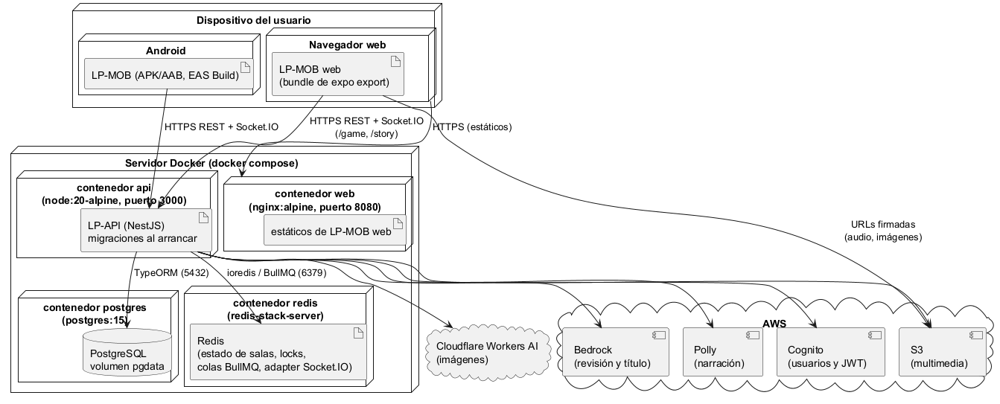

*Nota.* Elaboración propia. Fuente: `docs/diagrams/deployment-diagram.puml`.

# Guía de uso de los módulos de IA

- **Revisión de inglés.** Se activa con `BEDROCK_REVIEW_MODEL_ID`, que debe ser el inference profile de Amazon Nova 2 Lite (por ejemplo, `us.amazon.nova-2-lite-v1:0`; AWS, s.f.-a). Usa `temperature: 0` y un tiempo máximo de 8 s con un reintento. Los prompts están versionados en `language-review/prompts`: para cambiar uno se crea un archivo `v2` en lugar de editar el publicado.
- **Narración.** Polly con voz neural (por defecto Joanna) genera un mp3 y las marcas de tiempo de cada palabra, que la aplicación usa para resaltar la palabra que se está leyendo (AWS, s.f.-b).
- **Imágenes.** Se activan con `IMAGE_PROVIDER=cloudflare`. Usan FLUX.1 schnell en Cloudflare Workers AI (Cloudflare, s.f.), con 5 intentos de 30 s por imagen. Un error de cuota (429) detiene los intentos para esa historieta. El prompt combina un estilo fijo, el escenario, las fichas de los personajes y la acción de la viñeta.

En los tres casos, si el servicio falla o no está configurado, la partida sigue: sin revisión se asigna un puntaje fijo, sin audio la viñeta se lee sin narración y sin imagen se muestra sin ilustración.

# Seguridad, trazabilidad y respaldo

- **Autenticación.**
  - AWS Cognito emite los tokens (AWS, s.f.-c).
  - La API valida la firma con las claves públicas del User Pool (JWKS), el emisor, que el token sea de tipo `access` y que pertenezca al App Client configurado.
  - Los sockets se validan al conectarse con `aws-jwt-verify`.
- **Autorización.** `RolesGuard` exige los grupos de Cognito indicados con `@Roles`. La interfaz además oculta las secciones de administración, pero la autorización real siempre la aplica la API.
- **Validación.** Un `ValidationPipe` global se aplica con `whitelist` y `forbidNonWhitelisted`: la API rechaza los campos no declarados en los DTO.
- **Datos.** Los archivos de S3 son privados y se entregan con URLs firmadas: 15 minutos por defecto y 2 horas para la media de las historietas (AWS, s.f.-d). En el cliente, la sesión se guarda con SecureStore en el móvil y con localStorage en web.
- **CORS.** `CORS_ORIGINS` restringe los orígenes web. Vacío acepta todos, lo que solo sirve para desarrollo.
- **Trazabilidad.** Cada acción de moderación queda en `story_moderation_log` con el administrador, el motivo, la nota y la fecha. Las historietas quitadas se conservan.
- **Respaldo.** [PENDIENTE: política de respaldo]. Se recomienda un volcado periódico de PostgreSQL (`pg_dump`) del volumen `pgdata` y activar el versionado del bucket de S3. Redis solo guarda estado temporal, que no hace falta respaldar.

# Mantenimiento y actualización

- **Pruebas.**
  - La API tiene 469 pruebas con Jest: `yarn test`, más `yarn test:e2e` para las end-to-end. Algunas suites necesitan un Redis real y se saltan si no lo encuentran.
  - El cliente se valida con `npx tsc --noEmit` y con Storybook para los componentes.
- **Cambios en la base de datos.** Se modifica la entidad, se ejecuta `yarn migration:generate`, se revisa la migración generada y se aplica con `yarn migration:run`. Nunca hay que editar una migración que ya se aplicó en otro entorno.
- **Dependencias.** Hay que actualizar Expo con `npx expo install --fix` para mantener versiones compatibles con el SDK, y actualizar NestJS con todos sus paquetes a la misma versión mayor.
- **Submódulos.** Cada aplicación es un repositorio. Después de un cambio, se registra el commit nuevo en el repositorio raíz con `git add apps/<app>`.
- **Documentación.** Los diagramas se editan en `docs/diagrams/*.puml` y se exportan con PlantUML (ver `docs/README.md`). Cada módulo del modo Historieta tiene su propio README con su contrato.

# Referencias

Amazon Web Services. (s.f.-a). *Amazon Bedrock documentation*. https://docs.aws.amazon.com/bedrock/

Amazon Web Services. (s.f.-b). *Amazon Polly documentation*. https://docs.aws.amazon.com/polly/

Amazon Web Services. (s.f.-c). *Amazon Cognito documentation*. https://docs.aws.amazon.com/cognito/

Amazon Web Services. (s.f.-d). *Amazon Simple Storage Service documentation*. https://docs.aws.amazon.com/s3/

American Psychological Association. (2020). *Publication manual of the American Psychological Association* (7.ª ed.). https://doi.org/10.1037/0000165-000

BullMQ. (s.f.). *BullMQ documentation*. https://docs.bullmq.io/

Cloudflare. (s.f.). *Workers AI documentation*. https://developers.cloudflare.com/workers-ai/

Congreso de Colombia. (1982, 28 de enero). *Ley 23 de 1982, sobre derechos de autor*.

Consejo de Europa. (2020). *Common European Framework of Reference for Languages: Learning, teaching, assessment – Companion volume*. Council of Europe Publishing. https://www.coe.int/lang-cefr

Docker. (s.f.). *Docker documentation*. https://docs.docker.com/

Expo. (s.f.). *Expo documentation*. https://docs.expo.dev/

Meta Platforms. (s.f.). *React Native documentation*. https://reactnative.dev/docs/getting-started

NestJS. (s.f.). *NestJS documentation*. https://docs.nestjs.com/

PostgreSQL Global Development Group. (s.f.). *PostgreSQL 15 documentation*. https://www.postgresql.org/docs/15/

Presidencia de la República de Colombia. (1989, 23 de junio). *Decreto 1360 de 1989, por el cual se reglamenta la inscripción de soporte lógico (software) en el Registro Nacional del Derecho de Autor*.

Redis. (s.f.). *Redis documentation*. https://redis.io/docs/

Socket.IO. (s.f.). *Socket.IO documentation (v4)*. https://socket.io/docs/v4/

TypeORM. (s.f.). *TypeORM documentation*. https://typeorm.io/
